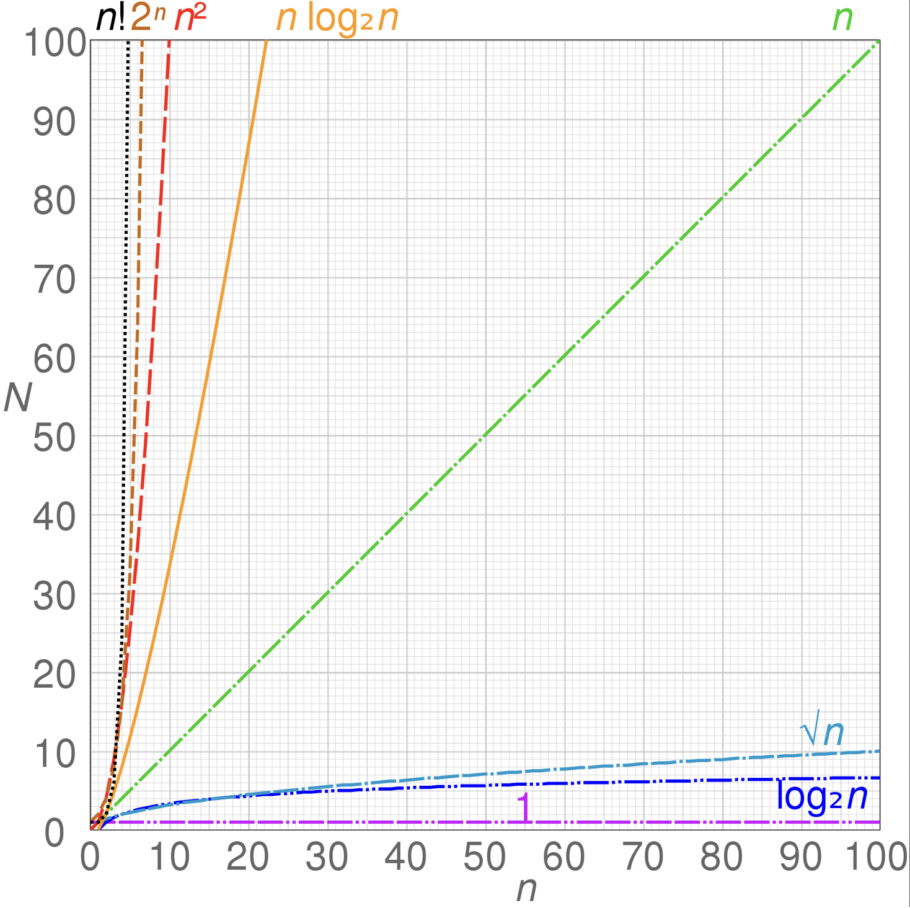

# Introduction
This is a tutorial lesson for data structure using python
#### What is big O notation
The big O notation is the tool we can evalute the efficiency for the function.
* O(n) take n times for the worse
```python
def multiple_loops(n): 
	for i in range(n): 
		print(i)
```
* O(2n) or (n+n) 

```python
def multiple_loops(n): 
	for i in range(n): 
		print(i)
	for j in range(n): 
		print(i**2)
```
* O(n^2)

```python
def multiple_loops(n): 
	for i in range(n): 
		for j in range(n): 
			print(i**2)
```
* O(3n)=O(n)I

2^n
N!


***
[return to page](README.md)
