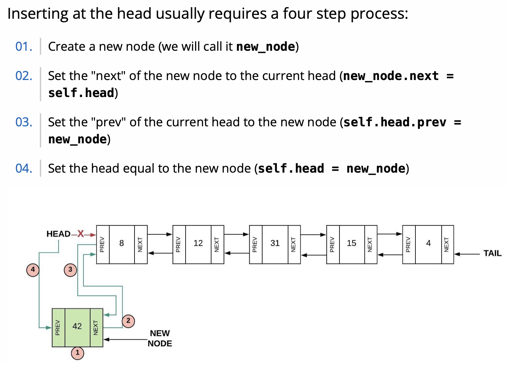
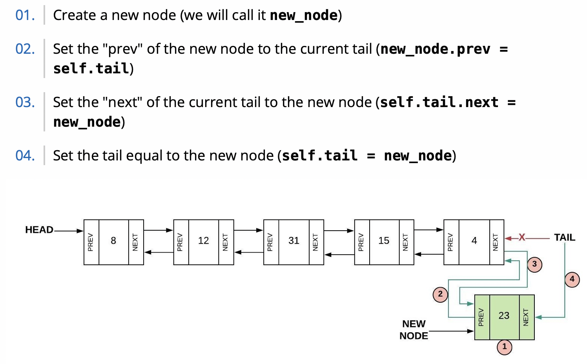
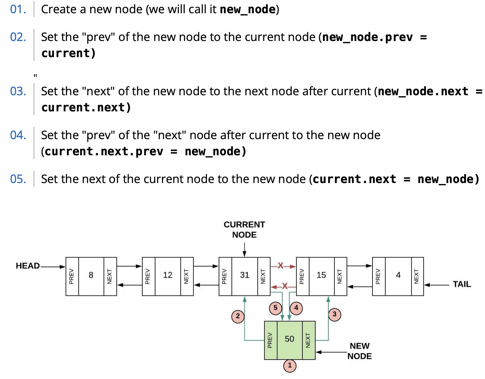
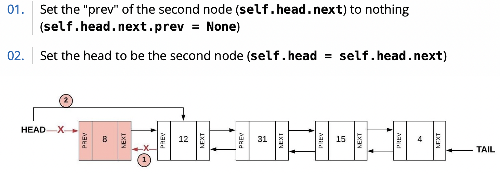
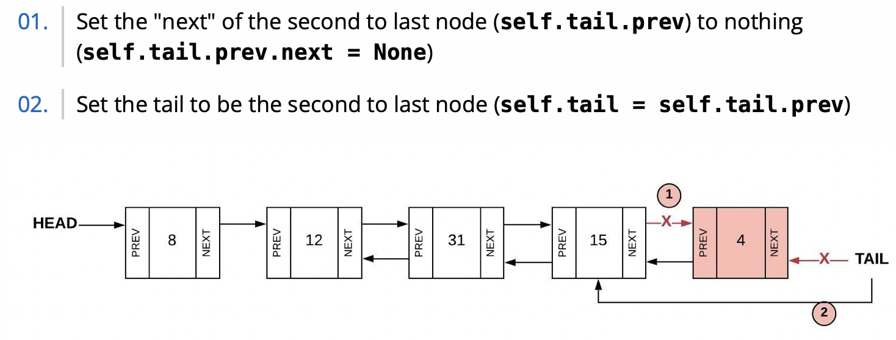
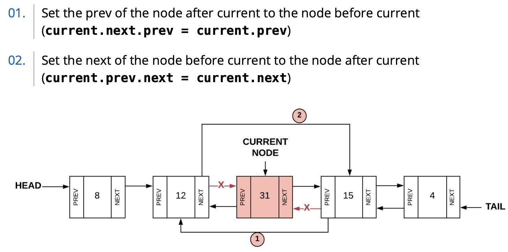

# Linked list
## Introduction:
Linked lists organize and store the data in a random way with in memory, so the data is not next to each other. In order to organize the data, linked lists use **node** and **pointer** to organize data. Each element is a node. We use the pointer to point to next value.

The first node in the linked list is **Head**, the node at the end of the linked list we called **Tail**

Python does have a linked list available for use called the deque. To create an empty linked list, the following code is used: link_list = deque(). You will need to include the following import statement as well: import deque. The table below shows the common functions in the deque.

Function|Description|Python Code|Performance
-|-|-|-
insert_head(value)|Adds "value" before the head|my_deque.appendleft(value)|O(1)
insert_tail(value)|Adds "value" after the tail|my_deque.append(value)|O(1)
insert(i, value)|Adds "value" after node i|my_deque.insert(i, value)|O(n)
Remove_head(value)|Remove "value" before the head|my_deque.popleft(value)|O(1)
Remove_tail(value)|Remove "value" after the tail|my_deque.pop(value)|O(1)
Remove(i, value)|Remove "value" after node i|my_deque.deque(i, value)|O(n)
Size|Returns the number of items in the linked list|length = len(my_deque)|O(1)
Empty()|Returns true if the length if the linked list is zero|if len(my_deque)==0:|O(1)

## Inserting into a Linked List




## Removing from a Linked List




## Example for Linked List:
Create a Class Node
```python
class Node:
    def __init__(self, data = None, next = None, prev = None):
        self.data = data
        self.next = next
        self.prev = prev
```
Create a Class Node
```python
class LinkedList:
    def __init__(self):
        self.head = None
        self.tail = None
```
insert head
```python
def insert_head(self, value):
        
    # Create the new node
    new_node = LinkedList.Node(value)  

    # If the list is empty, then point both head and tail
    # to the new node.
    if self.head is None:
        self.head = new_node
        self.tail = new_node
    # If the list is not empty, then only self.head will be
    # affected.
    else:
        new_node.next = self.head # Connect new node to the previous head
        self.head.prev = new_node # Connect the previous head to the new node
        self.head = new_node      # Update the head to point to the new node
```
## Practice and challenge:
Practice: try to make a function for insert tail
```python
def insert_tail(self, value):
        
```
## Answer:
[here]()
***
[back to title page](https://github.com/ListenOne1/cse212-final-project/blob/main/README.md#programming-with-data-structures-python)
